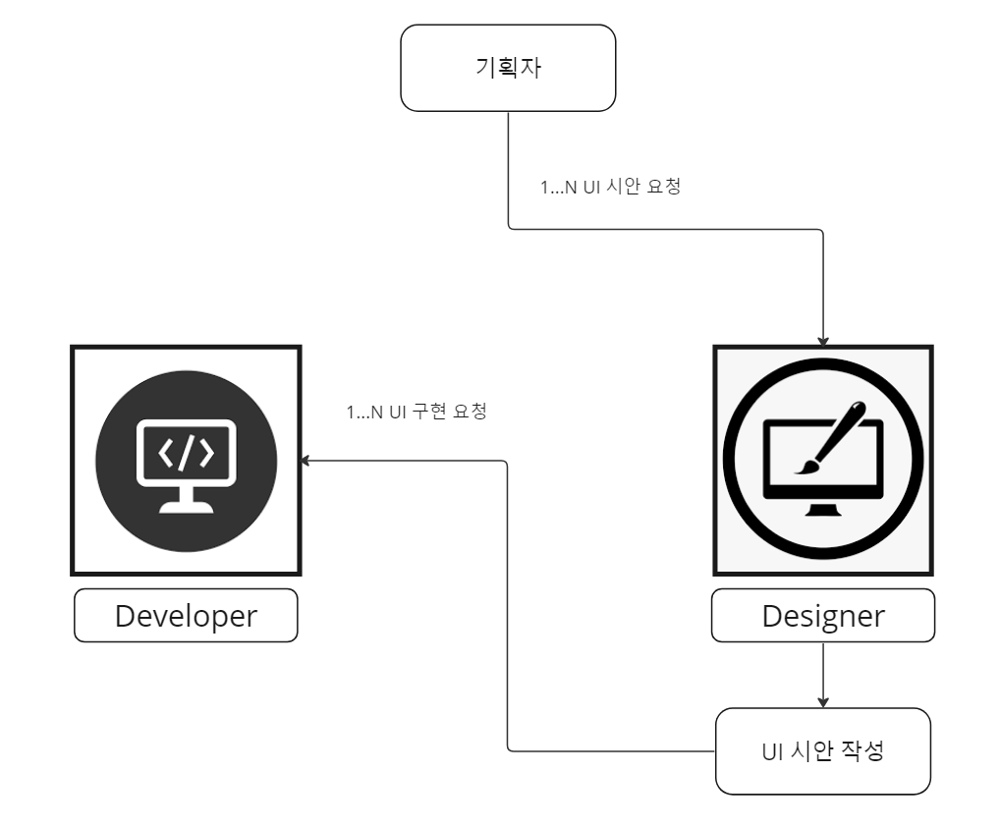
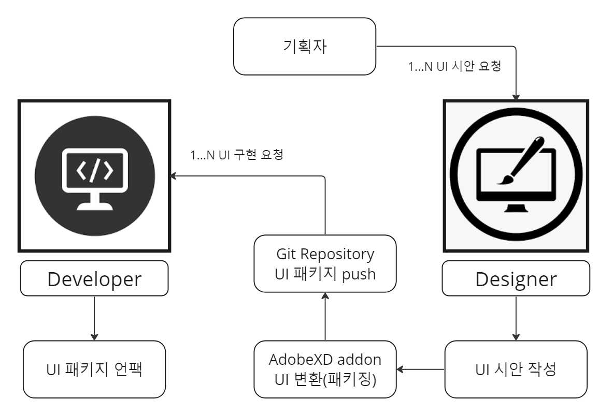

# -2022-AdobeXD-Automation
AdobeXD to Unity Auto-Converting test

- 디자이너와 유니티 개발자 간의 UI 구현 코스트를 줄인다.

 

### 개발 컨셉

> UI 시안의 구현/변경 요청은 디자이너에게도, 개발자에게도 시간을 필요로 한다. 
기획 구간에서 빈번하게 발생하는 UI 요청의 구현 비용을 줄여서 프로젝트의 기간 내 완성을 보장하도록 하자.

 

 이전의 UI구현 프로세스 

- 기존의 UI 구현 프로세스는 [기획자: 요청] - [디자이너: 시안 작성] - [개발자: 시안 구현] 순으로 진행됨.
- 기획자의 요청은 비동기적으로 자주 실행되는 반면, 최종 개발자의 UI 구현은 기획의 시안 요청과 별개로, 개발 일정이 잡혀있음. 개발 일정에 따라 개발을 진행중에 요구받는 UI 시안 구현/변경 요청은 횟수가 적으면 대응 가능하지만, 횟수가 4,5회 이상으로 늘어날 경우, 개발 일정을 지키기 어려움.
- UI 시안 요청 건의 구현 비용을 줄여서 UI 구현 요청 건에 대응해야함

 개선된 UI구현 프로세스 

- 개발자와 디자이너는 UI 시안을 템플릿화(버튼, 슬라이더, 창 단위) 한다.
- 디자이너는 템플릿화된 UI 시안을 늘이거나 줄이고, 색을 입히고, 이미지를 입히는 작업만으로 시안 요청에 대응한다.
- 개발자는 AdobeXD addon을 통해 변환된 UI 패키지를 Unity로 가져온다. 그리고 작성된 코드에 따라 UI 패키지를 Unity UGUI로 변환한다.

